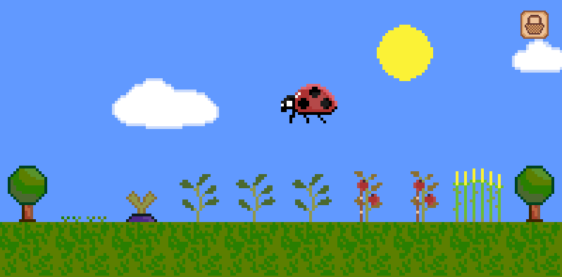

# Planter

## About
Plan carefully where to grow your crops in this simple farming simulation game.

## Controls
- Left-click: Plant seeds, harvest crops, clear grass
- Up/Down arrows or mouse wheel: Cycle through available seed types
- B: Open/close the shop
- P: Pause/resume the game

## Features
- Multiple crop types with different values
- Sunlight affects plant growth speed
- Ladybugs help pollinate plants at the right growth stage
- Buy seeds from the shop with money earned from harvesting

## Development
Built with LÖVE2D framework.